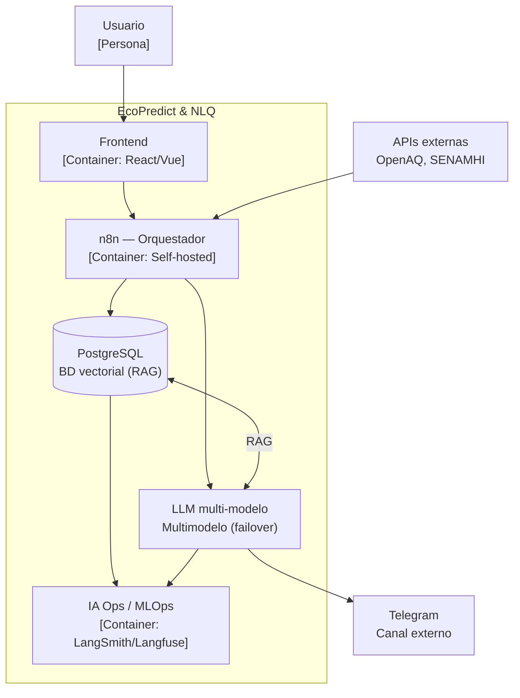
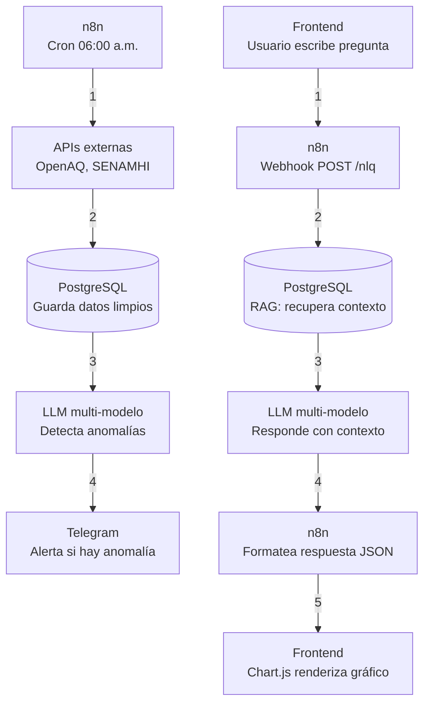

# Arquitectura del Sistema - EcoPredict & NLQ

Este documento muestra la arquitectura general en 5 capas y la secuencia detallada de los dos flujos principales del proyecto EcoPredict & NLQ.

---

## 1. Arquitectura General del Sistema

## 2. Diagrama de Flujos  

## 3. Secuencia de Flujo A

Ejecución Programada: Un temporizador interno en n8n activa el flujo de manera automática todos los días a las 06:00 a.m.

Consulta a Fuentes Externas: n8n realiza peticiones HTTP a las APIs externas de OpenAQ y SENAMHI para extraer las lecturas más recientes.

Procesamiento y Persistencia: El orquestador estandariza las mediciones y las guarda estructuradamente dentro de PostgreSQL.

Análisis de Anomalías: La información registrada se evalúa mediante el LLM multi-modelo para determinar picos inusuales de contaminación.

Emisión de Alertas: En caso de confirmarse un patrón anómalo, n8n despacha una notificación de alerta hacia el canal de Telegram.

## 4. Secuencia de Flujo B

Entrada de Consulta: El usuario escribe una pregunta en lenguaje natural a través de la interfaz del Frontend.

Recepción Webhook: El Frontend envía una petición HTTP POST /nlq hacia el punto de entrada de n8n.

Búsqueda Semántica (RAG): n8n ejecuta una consulta vectorial en PostgreSQL (pgvector) para extraer el contexto histórico más relevante.

Generación de Respuesta: La consulta enriquecida con el contexto recuperado se transfiere al LLM multi-modelo, el cual construye una respuesta precisa.

Formateo de Salida: n8n convierte la respuesta recibida en una estructura de datos JSON estandarizada.

Renderizado Visual: El Frontend procesa el archivo JSON y genera gráficos dinámicos interactivos mediante Chart.js.
